# Docker 笔记

## docker 命令

```powershell
$ docker run -it --rm tomcat:9.0 ##测试用，用完即删，docker ps -a 也搜索记录
```

### 启动容器 --tomcat为例

```powershell
$ docker run -d -p 8859:8080 --name tomcat01 tomcat ## -d 后台运行 ，-p 暴露端口号 ，
## 8859--外部端口，8080--tomcat服务端口，--name -- 给容器取名自 tomcat -- 镜像名
```

### 查看内存

```powershell
$ docker stats ##查看CUP的使用情况
```

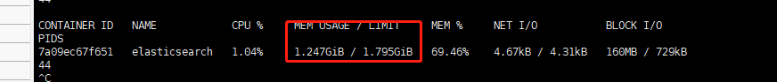

### 限制内存  添加参数   -e

```powershell
$ docker run -d --name elasticsearch02 -p 9200:9200 -p 9300:9300 -e "discovery.type=single-node" -e ES_JAVA_OPTS="-Xms64m -Xmx512m" elasticsearch:7.6.2
```

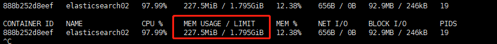

### 使用kibanna连接es

网络原理图


## 可视化工具

- ### portainer
  
  docker图形化管理工具

```powershell
$ docker run -d -p 8088:9000 \
--restart=always -v /var/run/docker.sock:/var/run/docker.sock --privileged=true portainer/portainer
# -v 挂载 --privileged  授予访问权限
```

外网访问portainer

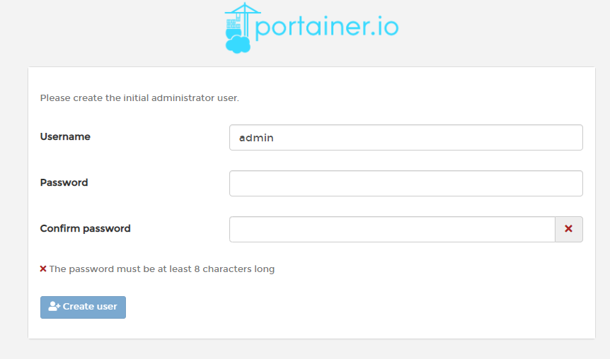

设置密码后登录的界面

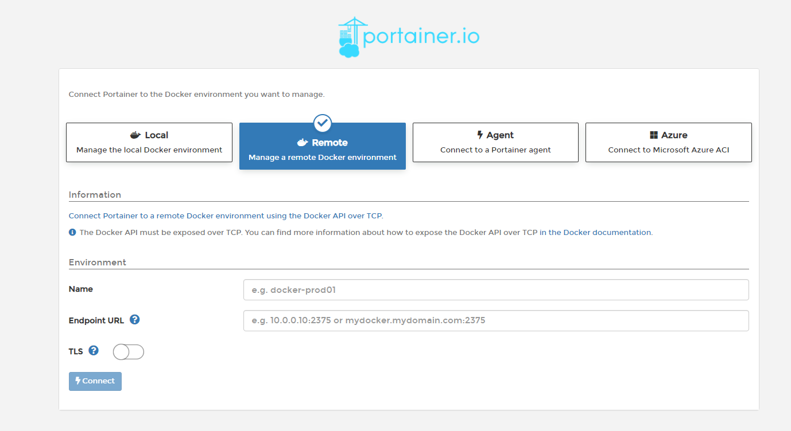

<br/>

- ### Rancher(CI/CD)

<br/>

<br/>

## docker分层思想--联合文件系统

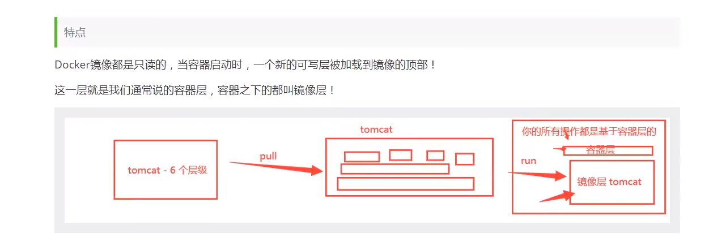

### commit提交自己镜像

```powershell
$ docker commit -m="提交的描述信息" -a="作者" 容器id 目标镜像名:[TAG]
```

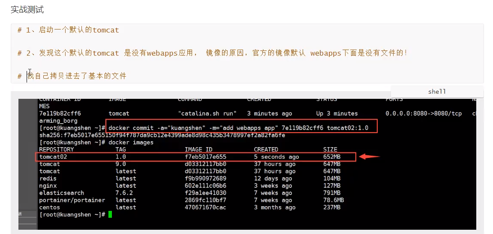

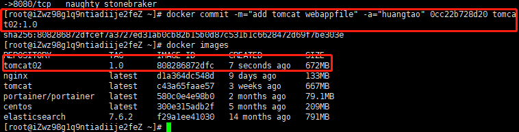

如果想保存当前容器的状态，可以使用commit提交这个容器，获得一个镜像，就像vm虚拟机的快照一样。

## 容器数据卷

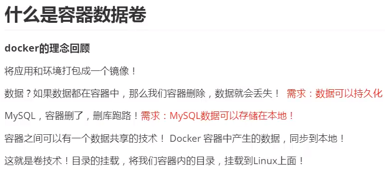

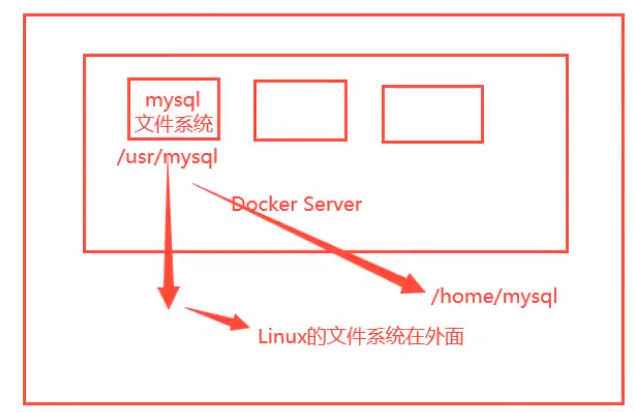


### 使用数据卷

#### 方式1：直接使用命令来挂载 -v

```powershell
$ docker run -it -v 主机目录：容器目录 #和-p（暴露端口） 相似
```

##### 容器内部目录

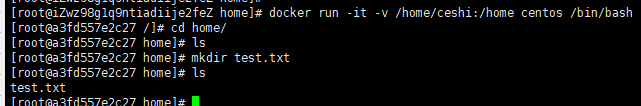

##### 主机目录

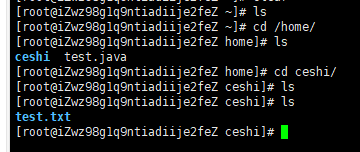

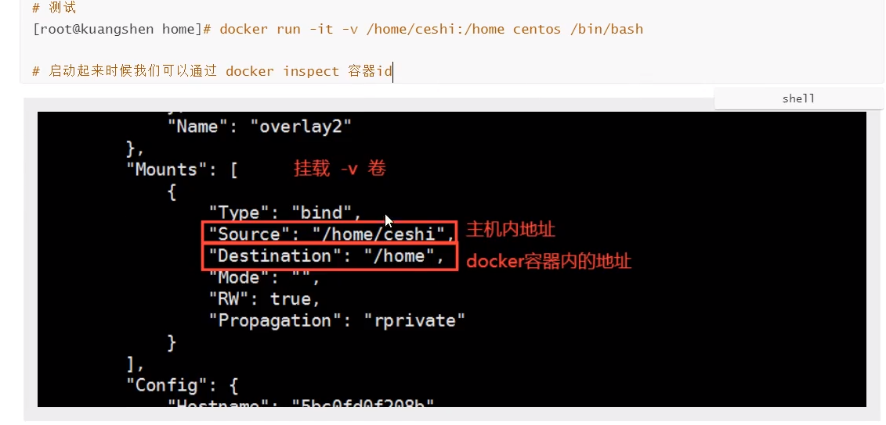

同步过程，双向绑定。在主机挂载目录中新建文件会同步到容器目录中，反之亦然

停止容器后，在主机上修改文件，再次启动容器，容器内部的数据依旧是同步的

##### 实战挂载mysql的数据存储目录和配置文件目录

```powershell
#启动mysql容器需要添加密码  官方文档
$ docker run --name some-mysql -v /my/custom:/etc/mysql/conf.d -e MYSQL_ROOT_PASSWORD=my-secret-pw -d mysql:tag
# -e添加参数 环境配置
#启动MySQL容器
$ docker run -d -p 3310:3306 -v /home/mysql/conf:/etc/mysql/conf.d -v /home/mysql/data:/var/lib/mysql -e MYSQL_ROOT_PASSWORD=123456 --name mysql01 mysql:5.7
```

##### 第三方工具连接mysql

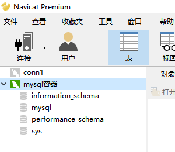


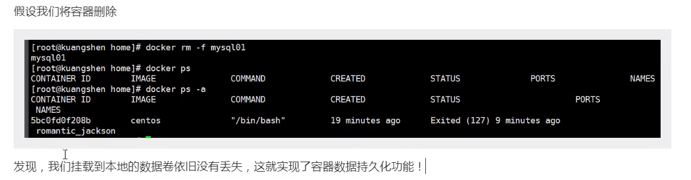

### 具名挂载和匿名挂载

```powershell
#匿名挂载
-v 容器内路径
$ docker run -d -P --name nginx01 -v /etc/nginx nginx 

#查看卷
$ docker volume ls
```

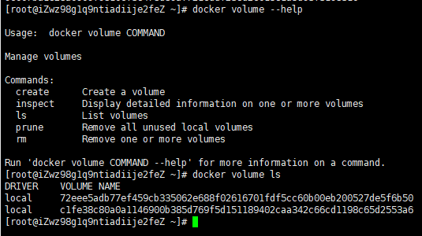

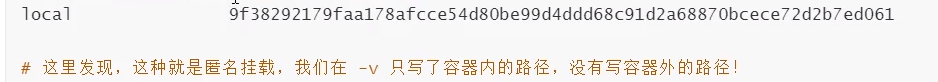

```shell
#具名挂载
[root@iZwz98g1q9ntiadiije2feZ ~]# docker run -d -P --name nginx02 -v juming-voluma:/etc/nginx nginx  # -P 随机指定端口映射 -v 卷名：容器内路径
0bd616888883fd3f3822cb100dcd6d0d3cddda31bd97d732a7f197049114a708
[root@iZwz98g1q9ntiadiije2feZ ~]# docker volume ls
DRIVER    VOLUME NAME
local     juming-voluma
```

查看这个卷的路径

```shell
$  docker volume inspect juming-voluma
```


```shell
#具名挂载、匿名挂载、指定路径挂载区分
-v 容器内路径  			#匿名挂载
-v 卷名：容器内路径	  	  #具名挂载
-v 宿主机路径：容器内路径  #指定路径挂载
```


### DockerFile--初识

通过dockerfile来挂载目录

DockerFile就是用来构建docker镜像的构建文件，就是命令脚本！通过脚本生成镜像！

```shell
#练习
#1.生成一个dockerfile文件
```


```shell
#dockfile文件中指令必须是大写，需要指定基础的内核
#2.运行dockfile生成docker镜像 
$  dockerfile-test-volume]# docker build -f dockfile1 -t ht/centos:1.0 .   #最后这个 . 很重要，必须要加上 -f dockerfile文件的路径 -t 镜像名：版本
```


### 数据卷容器


```shell
# 命令 --volumes-from  实现容器间的数据共享
```


相当于子容器继承了父容器，父容器称为数据卷容器，通过


## DockerFile

### DockFile的 构建过程


### DockerFile指令


```shell
FROM  			# 基础镜像，一切从这里开始构建
MAINTAINER		# 镜像是谁写的， 格式：姓名<邮箱>
RUN				#镜像构建的时候需要运行的命令
ADD				#添加环境，比如tomcat、mysql
WORKDIR			#指定镜像工作目录
VOLUME
EXPOSE			#暴露端口配置 和-p一致			
CMD				#指定容器启动的时候要运行的命令，只有最后一个会生效，可被替代
ENTRYPOINT		#指定容器启动的时候要运行的命令，可以追加命令
ONBUILD			#当构建一个被继承的DockerFile 这时候就会运行 OBUILD 的指令，就是一个触发指令
COPY			#与ADD相似，将我们的文件拷贝到镜像当中
ENV				#构建的时候设置环境变量
```

### 实战测试


>创建自己的centos

```shell
#1.编写一个自己的dokcfile文件
[root@huangtao dockerfile]# vim mydockerfile-centos
[root@huangtao dockerfile]# cat mydockerfile-centos 
FROM centos
MAINTAINER huangtao<212314121@qq.com>

ENV MYPATH /usr/local
WORKDIR $MYPATH

RUN yum -y install vim
RUN yum -y install net-tools

EXPOSE 80

CMD echo $MYPATH
CMD echo "------end-----"
CMD /bin/bash
#2.构建一个镜像
#命令 docker build -f dockfile文件路径 -t 镜像名:[tag] .

Successfully built c43a4de0c5d9
Successfully tagged mycentos:0.1

#3.测试运行
```


```shell
# 可以通过docker history 镜像名 查看镜像是如何一步一步的做出来的
```


>#### 制作一个tomcat镜像

1.准备镜像文件 tomcat压缩包，jdk压缩包！


2.编写dockerfile文件，官方命名`Dockerfile`,可以直接使用build构建镜像，就不需要`-f`来指定dockfile文件

```shell
FROM centos
MAINTAINER huangtao<1231231@qq.com>

COPY readme.txt /usr/local/readme.txt

ADD jdk-8u11-linux-x64.tar.gz /usr/local/
ADD apache-tomcat-9.0.22.tar.gz /usr/local/

RUN yum -f install vim

ENV MYPATH /usr/local/
WORKDIR $MYPATH

ENV JAVA_HOME /usr/local/jdk1.8.0_11
ENV CLASSPATH $JAVA_HOME/lib/dt.jar:$JAVA_HOME/lib/tools.jar
ENV CATALINA_HOME /usr/local/apache-tomcat-9.0.22
ENV CATALINA_BASH /usr/local/apache-tomcat-9.0.22
ENV PATH $PATH:$JAVA_HOME/bin:$CATALINA_HOME:/lib:$CATALINA_HOME:/bin

EXPOSE 8080

CMD /usr/local/apache-tomcat-9.0.22/bin/startup.sh && tail -F /usr/local/apache-tomcat-9.0.22/bin/logs/catalina.out
```

3.构建镜像文件

```shell
docker build -t diytomcat .
```

4.运行容器

```shell
docker run -d -p 9090:8080 -v /home/huangtao/build/tomcat/test/:/usr/local/apache-tomcat-9.0.22/webapps/test -v /home/huangtao/build/tomcat/tomcatlogs/:/usr/local/apache-tomcat-9.0.22/logs --name mytomcat diytomcat
```

**容器运行成功后，可能会出现无法访问的问题，在本地curl访问报错curl: (56) Recv failure: Connection reset by peer，这个时候先进入容器查看tomcat的日志信息，出现下图的错误信息。这个时候查看自己编写的dockerfile文件里面的环境变量的配置有没有问题**。


5 发布项目

```shell
#web.xml文件
<?xml version="1.0" encoding="UTF-8"?>
<web-app xmlns="http://java.sun.com/xml/ns/javaee"
           xmlns:xsi="http://www.w3.org/2001/XMLSchema-instance"
           xsi:schemaLocation="http://java.sun.com/xml/ns/javaee
                               http://java.sun.com/xml/ns/javaee/web-app_2_5.xsd"
           version="2.5">

</web-app>
#index.jsp文件
<html>
<head><title>Hello World</title></head>
<body>
Hello World!<br/>
<%
System.out.println("-----my test web logs------");
%>
</body>
</html>
```


### 发布镜像到DockerHub

```shell
#命令 首先需要登录上dockerhub官网
$  docker login --help 
$  docker login -u 用户名 -p 密码  #也可以不带参数 -p 
```


```shell
# login succeeded 表示登录成功
#发布到dockerhub上
$  docker push dockerhub账号用户名/镜像名:版本号 #发布时尽量加上自己的版本号
```


### 发布镜像到阿里云容器服务

1.登录阿里云

2.找到容器镜像服务

3.创建一个命名空间

4.创建一个镜像仓库

5.根据阿里云提供的步骤上传镜像至镜像仓库


## Docker完整流程


### 常用命令


## Docker网络

### 理解docker网络

```shell
#查看本机网卡
$  ip addr
```


#### docker容器之间的网络互通

```shell
#以tomcat为例
$  docker run -d -P --name tomcat01  tomcat

#查看tomcat01 这个容器的ip地址
$  docker exec -it tomcat01 ip addr  #后面还可以接不同的指令
```


```shell
#linux下ping通docker容器是可以ping通的
```


>原理


跟容器内部的ip很相似


2.容器和容器之间是可以相互ping通的


>网络原理图


### --Link


```shell
[root@huangtao ~]# docker run -d -P --name tomcat03 --link 需要link的容器ID tomcat
```


```shell
#tomcat03 link 上 tomcat02 之后，tomcat03能通过容器ping通tomcat02 ，反之却不行，tomcat02需要配后才能通过容器名ping通
#link后，tomcat03的/etc/hosts配置如下：
[root@huangtao ~]# docker exec -it tomcat03 cat /etc/hosts
127.0.0.1	localhost
::1	localhost ip6-localhost ip6-loopback
fe00::0	ip6-localnet
ff00::0	ip6-mcastprefix
ff02::1	ip6-allnodes
ff02::2	ip6-allrouters
172.17.0.3	9f70c34731fb 9f70c34731fb tomcat02
172.17.0.4	0dfc7d09913a
#未link，tomcat02的/etc/hosts配置如下：
[root@huangtao ~]# docker exec -it tomcat02 cat /etc/hosts
127.0.0.1	localhost
::1	localhost ip6-localhost ip6-loopback
fe00::0	ip6-localnet
ff00::0	ip6-mcastprefix
ff02::1	ip6-allnodes
ff02::2	ip6-allrouters
172.17.0.3	9f70c34731fb
```


### 自定义网络

